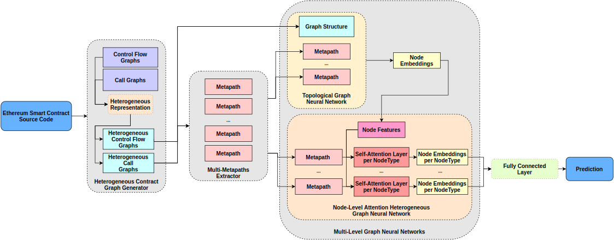

# Smart Contract Vulnerabilities

[](https://www.python.org/)
[](https://github.com/crytic/slither)
[](https://www.dgl.ai/)

# Multi-Level Graph Embeddings

[](https://github.com/erichoang/ge-sc)

This is an attempt to apply Multi-Level Graph Embeddings baseed on [HAN](https://arxiv.org/abs/1903.07293) for Vulnerability detection in smart contracts.
## How to train your own model?
- We currently supported 7 types of bug: `access_control`, `arithmetic`, `denial_of_service`, `front_running`, `reentrancy`, `time_manipulation`, `unchecked_low_level_calls`.
### Node Classification

- We used node classification tasks to detect vulnerabilites in line level and function level for Control flow graph (CFG) and Call graph (CG) in corressponding.

#### Usage

```bash
usage: HAN [-h] [-s SEED] [-ld LOG_DIR] [--output_models OUTPUT_MODELS]
           [--compressed_graph COMPRESSED_GRAPH] [--dataset DATASET]
           [--testset TESTSET] [--label LABEL]
           [--feature_compressed_graph FEATURE_COMPRESSED_GRAPH]
           [--cfg_feature_extractor CFG_FEATURE_EXTRACTOR]
           [--feature_extractor FEATURE_EXTRACTOR]
           [--node_feature NODE_FEATURE] [--k_folds K_FOLDS] [--test]
           [--non_visualize]

optional arguments:
  -h, --help            show this help message and exit
  -s SEED, --seed SEED  Random seed

Storage:
  Directories for util results

  -ld LOG_DIR, --log-dir LOG_DIR
                        Directory for saving training logs and visualization
  --output_models OUTPUT_MODELS
                        Where you want to save your models

Dataset:
  Dataset paths

  --compressed_graph COMPRESSED_GRAPH
                        Compressed graphs of dataset which was extracted by
                        graph helper tools
  --dataset DATASET     Dicrectory of all souce code files which were used to
                        extract the compressed graph
  --testset TESTSET     Dicrectory of all souce code files which is a
                        partition of the dataset for testing
  --label LABEL

Node feature:
  Define the way to get node features

  --feature_compressed_graph FEATURE_COMPRESSED_GRAPH
                        If "node_feature" is han, you mean use 2 HAN layers.
                        The first one is HAN of CFGs as feature node for the
                        second HAN of call graph, This is the compressed
                        graphs were trained for the first HAN
  --cfg_feature_extractor CFG_FEATURE_EXTRACTOR
                        If "node_feature" is han, feature_extractor is a
                        checkpoint of the first HAN layer
  --feature_extractor FEATURE_EXTRACTOR
                        If "node_feature" is "GAE" or "LINE" or "Node2vec", we
                        need a extracted features from those models
  --node_feature NODE_FEATURE
                        Kind of node features we want to use, here is one of
                        "nodetype", "metapath2vec", "han", "gae", "line",
                        "node2vec"

Optional configures:
  Advanced options

  --k_folds K_FOLDS     Config for cross validate strategy
  --test                Set true if you only want to run test phase
  --non_visualize       Wheather you want to visualize the metrics
```


## Testing

- We automatically run testing after training phase for now.

## Visuallization

- You also use tensorboard and take a look the trend of metrics for both training phase and testing phase.

```bash
tensorboard --logdir LOG_DIR
```