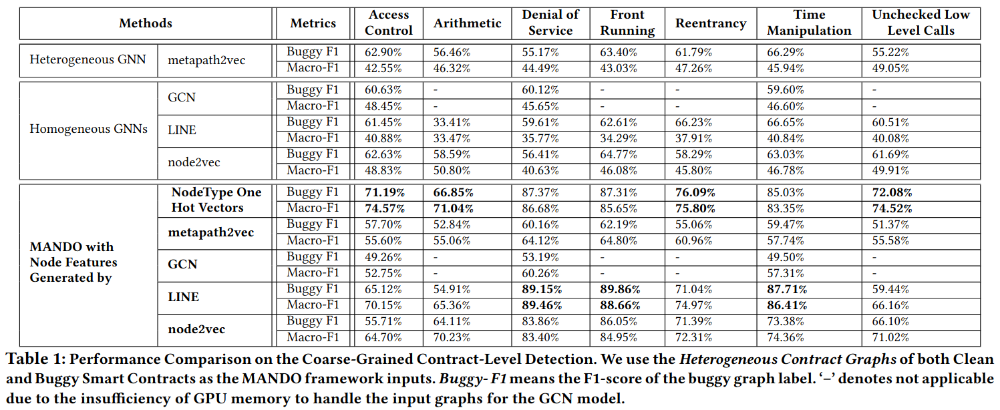
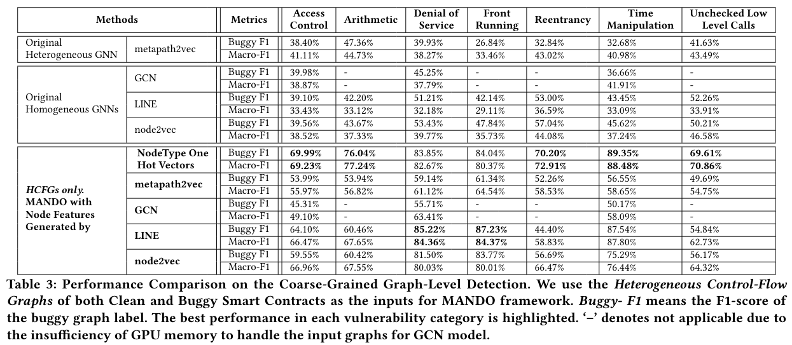

# Smart Contract Vulnerabilities
[](https://www.python.org/)
[](https://github.com/crytic/slither)
[](https://www.dgl.ai/)

# Multi-Level Graph Embeddings
[](https://anonymous.4open.science/r/ge-sc-FE31)
This repository is an implementation of MANDO: Multi-Level Heterogeneous Graph Embeddings for Fine-Grained Detection of Smart Contract Vulnerabilities.
The source code is based on the implementation of [HAN](https://github.com/dmlc/dgl/tree/master/examples/pytorch/han) and [GAT](https://github.com/dmlc/dgl/tree/master/examples/pytorch/gat) model using [Deep Graph Library](https://www.dgl.ai/).

# Table of contents

- [Smart Contract Vulnerabilities](#smart-contract-vulnerabilities)
- [Multi-Level Graph Embeddings](#multi-level-graph-embeddings)
- [Table of contents](#table-of-contents)
  - [How to train the models?](#how-to-train-the-models)
  - [System Description](#system-description)
  - [Install Environment](#install-environment)
  - [Inspection scripts](#inspection-scripts)
    - [Graph Classification](#graph-classification)
  - [Dataset](#dataset)
    - [Node Classification](#node-classification)
      - [Usage](#usage)
      - [Examples](#examples)
    - [Graph Classification](#graph-classification-1)
  - [Testing](#testing)
  - [Visuallization](#visuallization)
  - [Results](#results)
    - [Combine HCFGs and HCGs in Form-A Fusion.](#combine-cfgs-and-cgs-in-form-a-fusion) (Core Form in the MANDO paper.)
      - [Coarse-Grained Contract-Level Detection](#contract-level-classification)
      - [Fine-Grained Line-Level Detection](#line-level-classification)
    - [HCFGs only](#cfgs-only)
      - [Coarse-Grained Contract-Level Detection](#contract-level-classification-1)
    - [Combine HCFGs and HCGs in Form-B Fusion.](#combine-cfgs-and-cgs-in-form-b-fusion)
      - [Fine-Grained Function-Level Detection](#function-level-classification)

## How to train the models?

## System Description

We run all experiments on 
- Ubuntu 20.04
- CUDA 11.1
- NVIDA 3080

## Install Environment

Install python required packages.
```bash
pip install -r requirements.txt -f https://download.pytorch.org/whl/lts/1.8/torch_lts.html -f https://data.pyg.org/whl/torch-1.8.0+cu111.html -f https://data.dgl.ai/wheels/repo.html
```

## Inspection scripts

We provied inspection scripts for Graph Classification and Node Classification tasks as well as their required data.

### Graph Classification

Training Phase
```bash
python -m experiments.graph_classification
```
To show the result table

```bash
python -m experiments.graph_classification --result
```

- We currently supported 7 types of bug: `access_control`, `arithmetic`, `denial_of_service`, `front_running`, `reentrancy`, `time_manipulation`, `unchecked_low_level_calls`.

- Run the inspection 

## Dataset
- We prepared dataset for  submodule of this repositories. Please check it out for more details.

### Node Classification
- We used node classification tasks to detect vulnerabilites at the line level and function level for Heterogeneous Control flow graph (HCFGs) and Call Graphs (HCGs) in corressponding.

#### Usage
```bash
usage: HAN [-h] [-s SEED] [-ld LOG_DIR] [--output_models OUTPUT_MODELS]
           [--compressed_graph COMPRESSED_GRAPH] [--dataset DATASET]
           [--testset TESTSET] [--label LABEL]
           [--feature_compressed_graph FEATURE_COMPRESSED_GRAPH]
           [--cfg_feature_extractor CFG_FEATURE_EXTRACTOR]
           [--feature_extractor FEATURE_EXTRACTOR]
           [--node_feature NODE_FEATURE] [--k_folds K_FOLDS] [--test]
           [--non_visualize]

optional arguments:
  -h, --help            show this help message and exit
  -s SEED, --seed SEED  Random seed

Storage:
  Directories \for util results

  -ld LOG_DIR, --log-dir LOG_DIR
                        Directory for saving training logs and visualization
  --output_models OUTPUT_MODELS
                        Where you want to save your models

Dataset:
  Dataset paths

  --compressed_graph COMPRESSED_GRAPH
                        Compressed graphs of dataset which was extracted by
                        graph helper tools
  --dataset DATASET     Dicrectory of all souce code files which were used to
                        extract the compressed graph
  --testset TESTSET     Dicrectory of all souce code files which is a
                        partition of the dataset for testing
  --label LABEL

Node feature:
  Define the way to get node features

  --feature_compressed_graph FEATURE_COMPRESSED_GRAPH
                        If "node_feature" is han, you mean use 2 HAN layers.
                        The first one is HAN of CFGs as feature node for the
                        second HAN of call graph, This is the compressed
                        graphs were trained for the first HAN
  --cfg_feature_extractor CFG_FEATURE_EXTRACTOR
                        If "node_feature" is han, feature_extractor is a
                        checkpoint of the first HAN layer
  --feature_extractor FEATURE_EXTRACTOR
                        If "node_feature" is "GAE" or "LINE" or "Node2vec", we
                        need a extracted features from those models
  --node_feature NODE_FEATURE
                        Kind of node features we want to use, here is one of
                        "nodetype", "metapath2vec", "han", "gae", "line",
                        "node2vec"

Optional configures:
  Advanced options

  --k_folds K_FOLDS     Config cross validate strategy
  --test                If true you only want to run test phase
  --non_visualize       Wheather you want to visualize the metrics
```

#### Examples
We prepared some scripts for the custom HAN structures bellow:

- Node Classication for Heterogeous Control Flow Graphs (HCFGs) which detect vulnerabilites at the line level.
    - Nodetype one hot vector as node features for detection reentrancy bugs.
    ```bash
    python node_classifier.py -ld ./logs/node_classification/cfg/node2vec/reentrancy --output_models ./models/node_classification/cfg/node2vec/reentrancy --dataset ./ge-sc-data/node_classification/cfg/reentrancy/buggy_curated --compressed_graph ./ge-sc-data/node_classification/cfg/reentrancy/buggy_curated/compressed_graphs.gpickle --node_feature nodetype --testset ./ge-sc-data/node_classification/cfg/curated/reentrancy --seed 1
    ```
    - metapath2vec as node features.
    ```bash
    python node_classifier.py -ld ./logs/node_classification/cfg/node2vec/reentrancy --output_models ./models/node_classification/cfg/node2vec/reentrancy --dataset ./ge-sc-data/node_classification/cfg/reentrancy/buggy_curated --compressed_graph ./ge-sc-data/node_classification/cfg/reentrancy/buggy_curated/compressed_graphs.gpickle --node_feature metapath2vec --testset ./ge-sc-data/node_classification/cfg/curated/reentrancy --seed 1
    ```
    - Graph Auto Encoder (GAE) as node features.
    ```bash
    python node_classifier.py -ld ./logs/node_classification/cfg/gae/reentrancy --output_models ./models/node_classification/cfg/gae/reentrancy --dataset ./ge-sc-data/node_classification/cfg/reentrancy/buggy_curated --compressed_graph ./ge-sc-data/node_classification/cfg/reentrancy/buggy_curated/compressed_graphs.gpickle --node_feature gae --feature_extractor ./ge-sc-data/node_classification/cfg/gesc_matrices_node_embedding/matrix_gae_dim128_of_core_graph_of_reentrancy_compressed_graphs.pkl --testset ./data/smartbugs_wild/multi_class_cfg/curated/reentrancy --seed 1
    ```
    - LINE as node features.
    ```bash
    python node_classifier.py -ld ./logs/node_classification/cfg/gae/reentrancy --output_models ./models/node_classification/cfg/gae/reentrancy --dataset ./ge-sc-data/node_classification/cfg/reentrancy/buggy_curated --compressed_graph ./ge-sc-data/node_classification/cfg/reentrancy/buggy_curated/compressed_graphs.gpickle --node_feature line --feature_extractor ./ge-sc-data/node_classification/cfg/gesc_matrices_node_embedding/matrix_line_dim128_of_core_graph_of_reentrancy_compressed_graphs.pkl --testset ./data/smartbugs_wild/multi_class_cfg/curated/reentrancy --seed 1
    ```
    - node2vec as node features.
    ```bash
    python node_classifier.py -ld ./logs/node_classification/cfg/gae/reentrancy --output_models ./models/node_classification/cfg/gae/reentrancy --dataset ./ge-sc-data/node_classification/cfg/reentrancy/buggy_curated --compressed_graph ./ge-sc-data/node_classification/cfg/reentrancy/buggy_curated/compressed_graphs.gpickle --node_feature node2vec --feature_extractor ./ge-sc-data/node_classification/cfg/gesc_matrices_node_embedding/matrix_node2vec_dim128_of_core_graph_of_reentrancy_compressed_graphs.pkl --testset ./data/smartbugs_wild/multi_class_cfg/curated/reentrancy --seed 1
    ```

- Node Classification for Heterogeous Call Graphs (HCGs) which detect vulnerabilites at the function level.
- The command lines are the same as CFG except the dataset. 
    - Nodetype one hot vector as node features for detection reentrancy bugs.
    ```bash
    python node_classifier.py -ld ./logs/node_classification/cg/node2vec/reentrancy --output_models ./models/node_classification/cg/node2vec/reentrancy --dataset ./ge-sc-data/node_classification/cg/reentrancy/buggy_curated --compressed_graph ./ge-sc-data/node_classification/cg/reentrancy/buggy_curated/compressed_graphs.gpickle --node_feature nodetype --testset ./ge-sc-data/node_classification/cg/curated/reentrancy --seed 1
    ```
    - We also stack 2 HAN layers for CF. The first one will aggregate CFG nodes on line level in a CG node on function level as features of CG nodes.
    ```bash
    python node_classifier.py -ld ./logs/node_classification/call_graph/node2vec_han/reentrancy --output_models ./models/node_classification/call_graph/node2vec_han/reentrancy --dataset ./ge-sc-data/node_classification/cg/reentrancy/buggy_curated --compressed_graph ./ge-sc-data/node_classification/cg/reentrancy/buggy_curated/compressed_graphs.gpickle --testset ./ge-sc-data/node_classification/cg/curated/reentrancy --seed 1  --node_feature han --feature_compressed_graph ./data/smartbugs_wild/binary_class_cfg/reentrancy/buggy_curated/compressed_graphs.gpickle --cfg_feature_extractor ./data/smartbugs_wild/embeddings_buggy_currated_mixed/cfg_mixed/gesc_matrices_node_embedding/matrix_node2vec_dim128_of_core_graph_of_reentrancy_compressed_graphs.pkl --feature_extractor ./models/node_classification/cfg/node2vec/reentrancy/han_fold_0.pth
    ```

### Graph Classification
- TODO

## Testing
- We automatically run testing after training phase for now.

## Visuallization
- You also use tensorboard and take a look the trend of metrics for both training phase and testing phase.

```bash
tensorboard --logdir LOG_DIR
```

## Results

### Combine HCFGs and HCGs in Form-A Fusion.

#### Coarse-Grained Contract-Level Detection

[](https://anonymous.4open.science/r/ge-sc-FE31)

#### Fine-Grained Line-Level Detection

[](https://anonymous.4open.science/r/ge-sc-FE31)


### HCFGs only
#### Coarse-Grained Contract-Level Detection

[](https://anonymous.4open.science/r/ge-sc-FE31)

### Combine CFGs and CGs in Form-B Fusion.
#### Fine-Grained Function-Level Detection

[](https://anonymous.4open.science/r/ge-sc-FE31)

